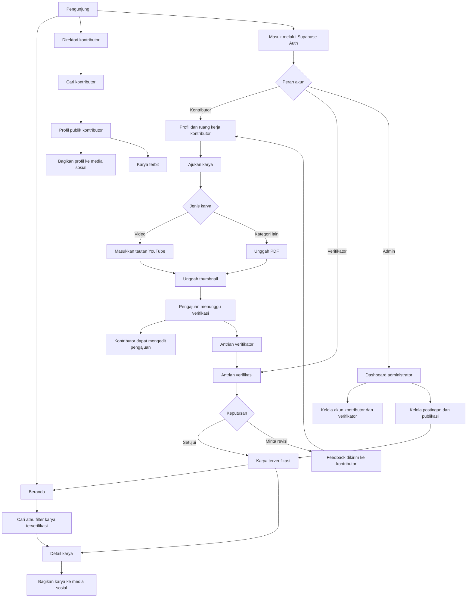

# Alur Aplikasi PINISI

```mermaid
flowchart TD
    Visitor[Pengunjung] --> Home[Beranda]
    Home --> Search[Cari atau filter karya terverifikasi]
    Search --> Work[Detail karya]
    Work --> ShareWork[Bagikan karya ke media sosial]
    Visitor --> Directory[Direktori kontributor]
    Directory --> SearchContributor[Cari kontributor]
    SearchContributor --> PublicProfile[Profil publik kontributor]
    PublicProfile --> ShareProfile[Bagikan profil ke media sosial]
    PublicProfile --> PublishedWorks[Karya terbit]

    Visitor --> Login[Masuk melalui Supabase Auth]
    Login --> Role{Peran akun}

    Role -->|Kontributor| Contributor[Profil dan ruang kerja kontributor]
    Contributor --> Submit[Ajukan karya]
    Submit --> Format{Jenis karya}
    Format -->|Video| Youtube[Masukkan tautan YouTube]
    Format -->|Kategori lain| Pdf[Unggah PDF]
    Youtube --> Thumbnail[Unggah thumbnail]
    Pdf --> Thumbnail
    Thumbnail --> Pending[Pengajuan menunggu verifikasi]
    Pending --> EditPending[Kontributor dapat mengedit pengajuan]
    Pending --> ReviewQueue[Antrian verifikator]

    Role -->|Verifikator| Verifier[Antrian verifikasi]
    ReviewQueue --> Verifier
    Verifier --> Decision{Keputusan}
    Decision -->|Setujui| Approved[Karya terverifikasi]
    Approved --> Home
    Approved --> Work
    Decision -->|Minta revisi| Revision[Feedback dikirim ke kontributor]
    Revision --> Contributor

    Role -->|Admin| Admin[Dashboard administrator]
    Admin --> Accounts[Kelola akun kontributor dan verifikator]
    Admin --> Posts[Kelola postingan dan publikasi]
    Posts --> Approved
```